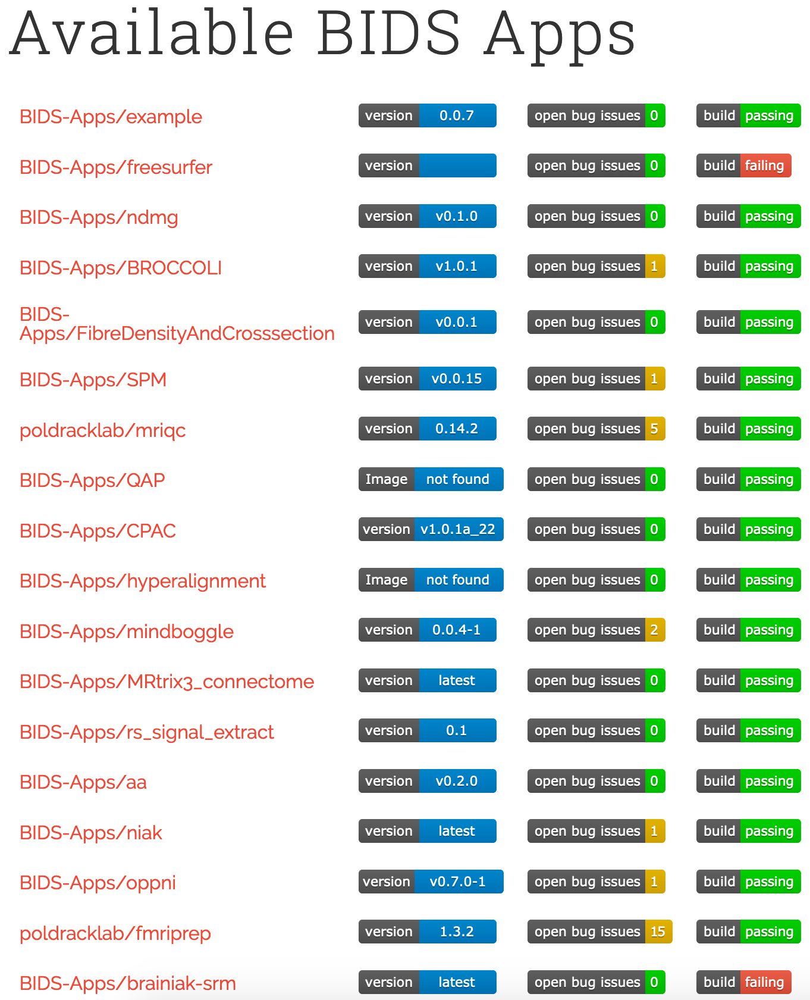
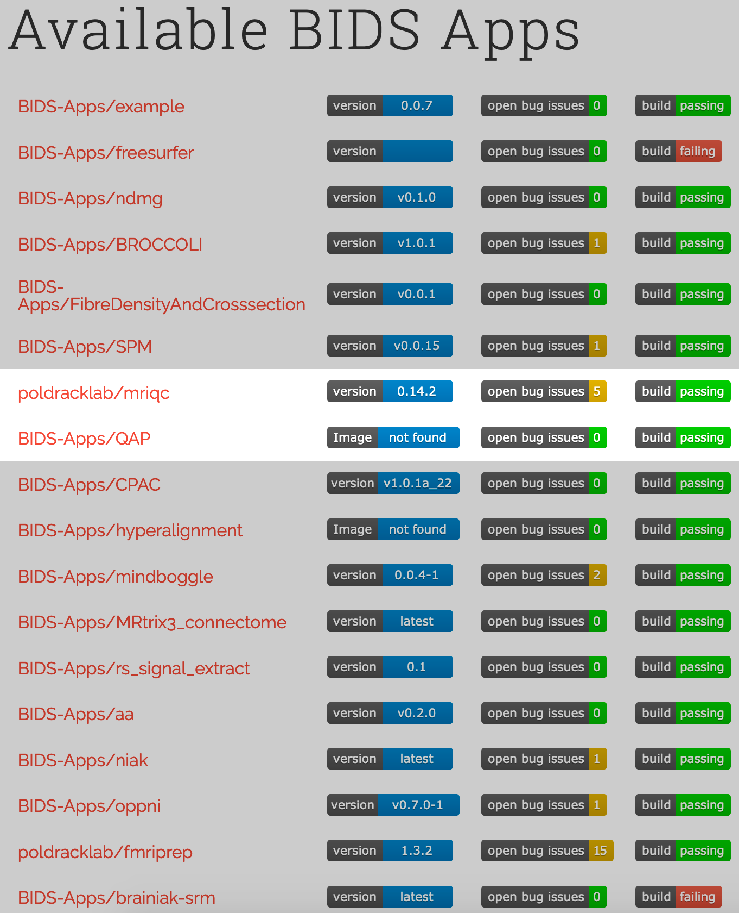
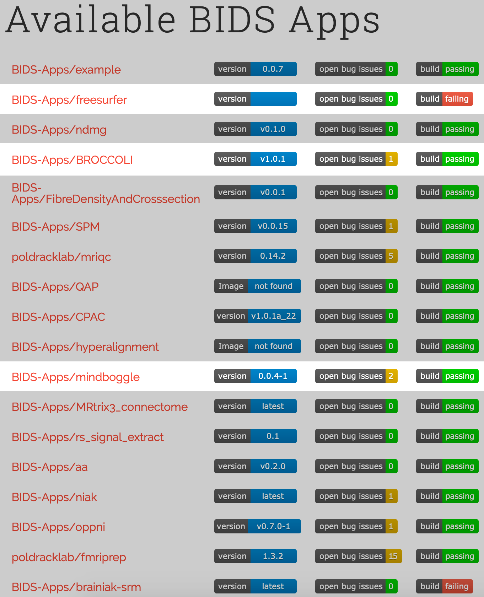
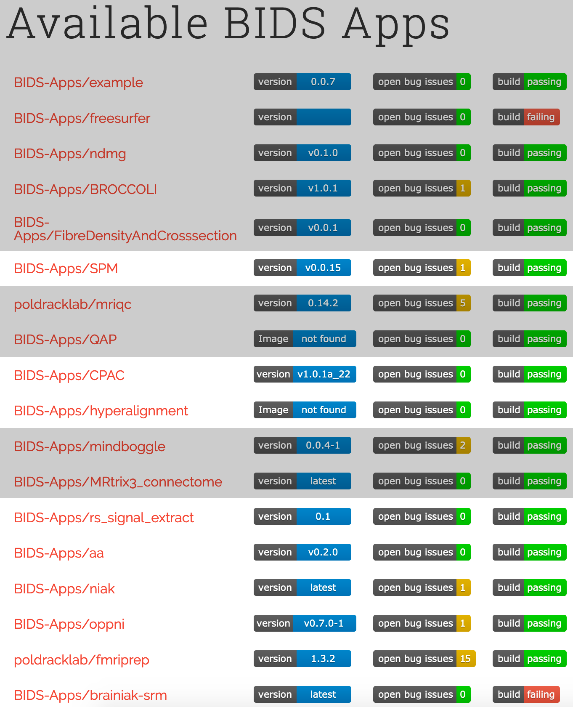
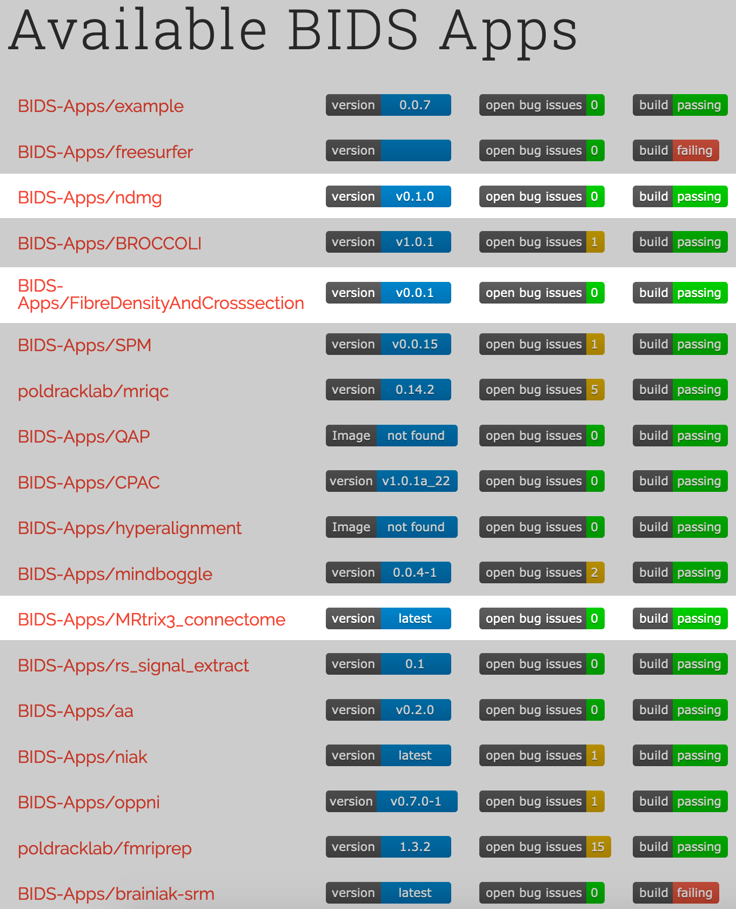
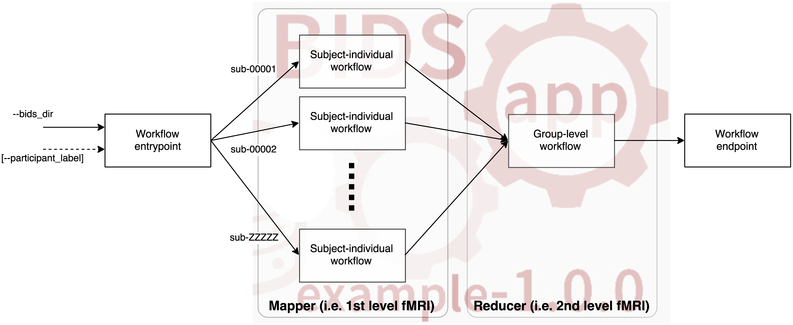

class: center middle

# BIDS Applications and Derivatives
### Christopher J. Markiewicz
#### Center for Reproducible Neuroscience
#### Stanford University

###### [effigies.github.io/bids-derivatives](https://effigies.github.io/bids-derivatives)

---
name: footer
layout: true

<div class="slide-slug">Open and Reproducible Neuroimaging - Oldenburg - Nov 2020</div>

---
layout: true
template: footer
name: BIDS

# BIDS: Brain Imaging Data Structure

---
layout: true
template: BIDS

.pull-left[]

---

.pull-right[
* BIDS is a directory structure, not a binary format

* Builds on existing standards (NIfTI, JSON, TSV)

* Intended for human *and* machine legibility

* The [BIDS Validator](https://bids-standard.github.io/bids-validator)
  makes compliance easy to verify

* The [specification](https://bids-specification.readthedocs.io/en/stable/)
  is a searchable HTML document
]

---

.pull-right[

* Basic metadata in the file names

  * Subject, session, imaging modality, etc.
  * Generally just enough to assign unique names

]

---
count: false

.pull-right[
* Basic metadata in the file names
  * Subject, session, imaging modality, etc.
  * Generally just enough to assign unique names

* NIfTI headers and JSON sidecars contain detailed,
  image-related metadata

]

---
count: false

.pull-right[
* Basic metadata in the file names
  * Subject, session, imaging modality, etc.
  * Generally just enough to assign unique names

* NIfTI headers and JSON sidecars contain detailed,
  image-related metadata

* [`dataset_description.json`](https://bids-specification.readthedocs.io/en/stable/03-modality-agnostic-files.html#dataset_descriptionjson),
  [`participants.tsv`](https://bids-specification.readthedocs.io/en/stable/03-modality-agnostic-files.html#participants-file),
  [`sessions.tsv`](https://bids-specification.readthedocs.io/en/stable/06-longitudinal-and-multi-site-studies.html#sessions-file),
  and [`scans.tsv`](https://bids-specification.readthedocs.io/en/stable/03-modality-agnostic-files.html#scans-file)
  record study-level metadata that may not be associated
  with specific images
]

---
layout: true
template: footer

.install-cmd[
```Bash
pip install pybids
```
]

---

# PyBIDS

A common specification of neuroimaging datasets affords queries for and
adaptation to the available data.

[PyBIDS](https://github.com/bids-standard/pybids/) is a Python library for
querying and manipulating BIDS datasets.


```Python
>>> from bids import BIDSLayout
>>> layout = BIDSLayout('/data/bids/openneuro/ds000003')
>>> bold = layout.get(subject='01', suffix='bold', extension='.nii.gz')
>>> bold
[<BIDSImageFile filename='.../sub-01/func/sub-01_task-rhymejudgment_bold.nii.gz'>]
>>> bold[0].get_metadata()
{'RepetitionTime': 2.0, 'TaskName': 'rhyme judgment'}
>>> bold[0].get_entities()
{'datatype': 'func',
 'extension': '.nii.gz',
 'subject': '01',
 'suffix': 'bold',
 'task': 'rhymejudgment'}
```

--

These are the sort of utilities everybody writes for whatever structure their
lab uses.

--

[BIDS-MATLAB](https://github.com/bids-standard/bids-matlab) is a similar project for MATLAB / Octave

---
layout: true
template: footer
name: Apps

# BIDS Applications

---

A common specification of neuroimaging datasets affords queries for and
adaptation to the available data.

--

Queryable (meta)data allows a very simple protocol for a
[BIDS App](https://bids-apps.neuroimaging.io/apps/):

```Bash
bids-app /bids-directory /output-directory participant [OPTIONS]
```

.footnote[
\* Note that `participant` is an analysis level. Apps may also operate
at the `run`, `session` or `group` levels.
]

--

## Examples

**MRIQC**

```Bash
mriqc /data/bids/openneuro/ds000228 /data/processed/ds000228-mriqc group
```

--

**fMRIPrep**

```Bash
fmriprep /data/bids/openneuro/ds000228 /data/processed/ds000228-fmriprep \
    participant --participant-label pixar001
```

---

.pull-left[
### Many application types are possible
]
.pull-right[
[](https://bids-apps.neuroimaging.io/apps/)
]

---
count: false

.pull-left[
### Many application types are possible

* Quality control

]
.pull-right[
[](https://bids-apps.neuroimaging.io/apps/)
]

---
count: false

.pull-left[
### Many application types are possible

* Quality control

* Anatomical pipelines

]
.pull-right[
[](https://bids-apps.neuroimaging.io/apps/)
]

---
count: false

.pull-left[
### Many application types are possible

* Quality control

* Anatomical pipelines

* Functional pipelines

]
.pull-right[
[](https://bids-apps.neuroimaging.io/apps/)
]

---
count: false

.pull-left[
### Many application types are possible

* Quality control

* Anatomical pipelines

* Functional pipelines

* Diffusion pipelines

]
.pull-right[
[](https://bids-apps.neuroimaging.io/apps/)
]

---
count: false

.pull-left[
### Many application types are possible

* Quality control

* Anatomical pipelines

* Functional pipelines

* Diffusion pipelines

### Lowered friction encourages adoption

* Researchers gain easy access to tools by formatting data
  in BIDS

* Accepting BIDS datasets makes your tools easy to try

]
.pull-right[
[](https://bids-apps.neuroimaging.io/apps/)
]

---

For development and distribution, BIDS Apps encourages a continuous-integration
(CI) approach.

<figure style="width: 70%">

<figcaption>From doi:</figcaption>
</figure>

--

The uniform interface also eases deployment to HPC or cloud environments like
[CBRAIN](http://mcin.ca/technology/cbrain/) or [AWS Batch](https://aws.amazon.com/batch/).

---

BIDS Apps use the notion of analysis levels, which provide natural opportunities for
parallelism.

<figure style="width: 100%">

<figcaption>From doi:</figcaption>
</figure>

---
layout: true
template: footer

# BIDS Apps and Reproducibility

---

Start-to-finish pipelines aid in performing *reproducible* analyses.

<figure style="width: 60%">

<figcaption>From <a href="https://the-turing-way.netlify.app/reproducibility/03/definitions.html#The-Turing-Way-definition-of-reproducibility">The
Turing Way, Ch. 2</a>; doi:</figcaption>
</figure>

--

Open analysis on open data is subject to independent reproduction.

--

Accepting BIDS datasets makes *replicating* results on independent data easier.

--

A common interface also makes independent analyses easier to write and compare.

---
layout: true
template: footer
name: Derivatives

# BIDS Derivatives

---

The output of a BIDS App is a *derivative* dataset. The BIDS standard is
[being extended](https://bids-specification.readthedocs.io/en/derivatives/05-derivatives/01-introduction.html)
to describe many types of derivatives, with a focus on derivatives that
can be reused in yet more BIDS apps.

--

#### Dataset-level metadata is stored in augmented [`dataset_description.json`](https://124-151034407-gh.circle-artifacts.com/0/home/circleci/project/site/05-derivatives/01-introduction.html#derived-dataset-and-pipeline-description):

* `GeneratedBy` contains references to the code (including versions)
  that produced the derivative dataset.
* `SourceDatasets` is a list of references to the specific version of the
  dataset analyzed

```YAML
{
  "Name": "FMRIPREP Outputs",
  "BIDSVersion": "1.4.0",
  "DatasetType": "derivative",
  "GeneratedBy": [{"Name": "fmriprep", "Version": "1.4.1"}],
  "SourceDatasets": [{"DOI": "10.18112/openneuro.ds000114.v1.0.1"}]
}
```

---

#### Basic metadata remains in filenames

```
fmriprep/sub-01/func/sub-01_task-rest_space-fsaverage_hemi-L_bold.func.gii
```

--

#### Additional metadata in [sidecar JSON files](https://124-151034407-gh.circle-artifacts.com/0/home/circleci/project/site/05-derivatives/01-introduction.html#common-file-level-metadata-fields)

* `Sources` direct inputs to the process that produced the file
* `CoordinateSystem` indicates the coordinate system of image files
* Metadata of source files that still apply should be preserved
* Metadata of source files that no longer apply must be removed

---

## Preprocessed or cleaned data

Preprocessing does not change the type of the data. For example,

```
rawdata/
  sub-01/
    func/
      sub-01_task-rest_bold.nii.gz

preprocessed/
  sub-01/
    func/
      sub-01_task-rest_space-MNI_desc-preproc_bold.nii.gz
```

* `space-<label>` - Indicates that a file has been registered to some
  reference, such as standard templates or another image
* `desc-<label>` - Generic label to describing preprocessing

Derivatives must have *some* distinguishing entity from raw data.

---

## Binary masks

Binary masks have the suffix `mask`.

```
lesion_masks/
  sub-01/
    anat/
      sub-01_desc-lesion_mask.nii.gz
```

## Segmentations

Discrete segmentations have the suffix `dseg` and probabilistic or
partial-volume segmentations have the suffix `probseg`.

```
parcellations/
  sub-01/
    anat/
      sub-01_space-orig_dseg.nii.gz
      sub-01_space-orig_label-WM_probseg.nii.gz
```

---

Derivatives generally fall into three categories:

1. Preprocessed images (or otherwise transformed data) that can be used for further
  analysis

  * Tissue segmentations
  * Normalized BOLD series
  * Filtered EEG time series

--

2. Measures of interest

  * Parcellation statistics
  * Local functional connectivity density
  * Fractional anisotropy

--

3. Figures and reports for assessing the quality of data/processing,
   or including in manuscripts

---
template: footer

# Conclusion

* BIDS is a standard for organizing neuroimaging data and metadata.

--

* PyBIDS/BIDS-MATLAB provides programmatic access to files and metadata in BIDS datasets.

--

* BIDS Apps use a common protocol to process datasets, improving interoperability and
  facilitating reproducibility.

--

* BIDS Derivatives are processed datasets that can be queried like BIDS datasets, enabling
  higher-order applications.

--

* Apps incentivize using BIDS, datasets incentivize writing apps.

--

* A growing ecosystem makes it worthwhile to produce tools that can take advantage of open
  datasets and derivatives.

---
layout: true
template: footer

class: center middle

---

# Thank You

##### [effigies.github.io/bids-derivatives](https://effigies.github.io/bids-derivatives)
